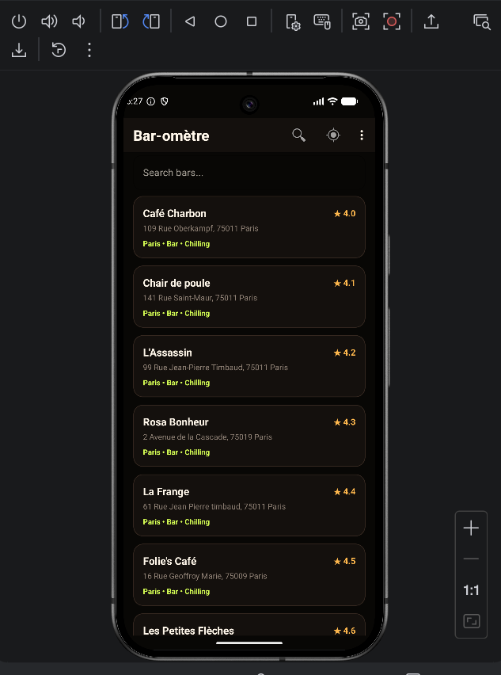
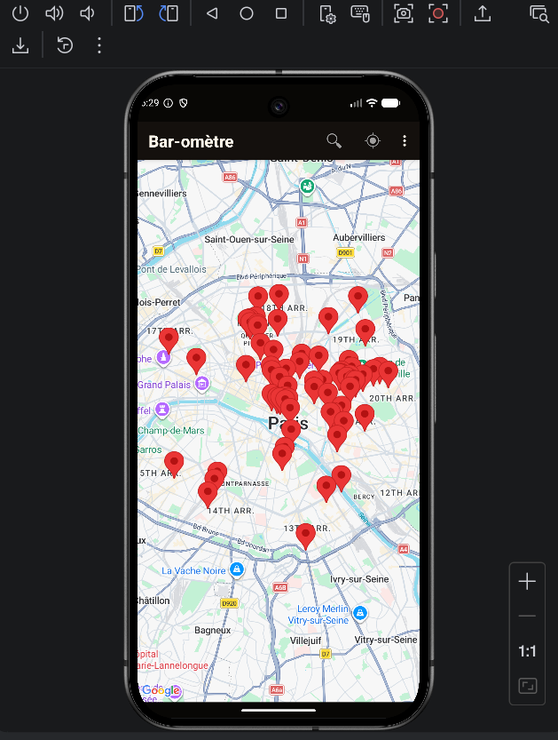
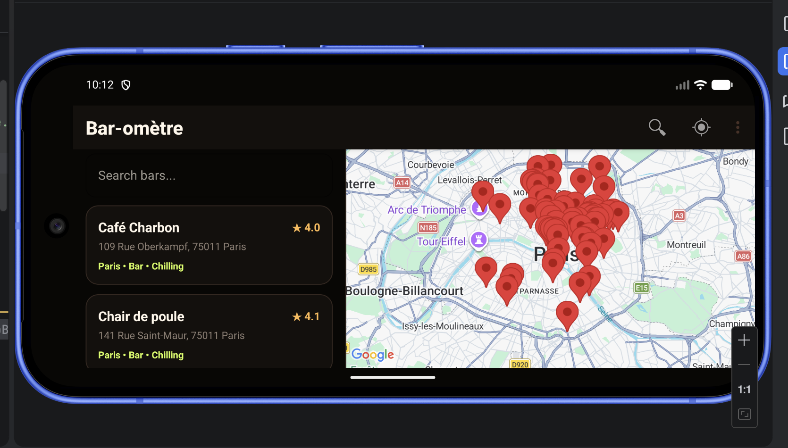
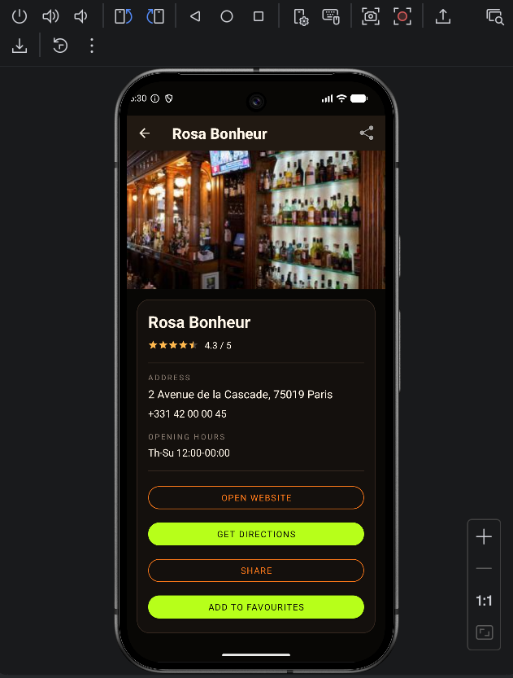
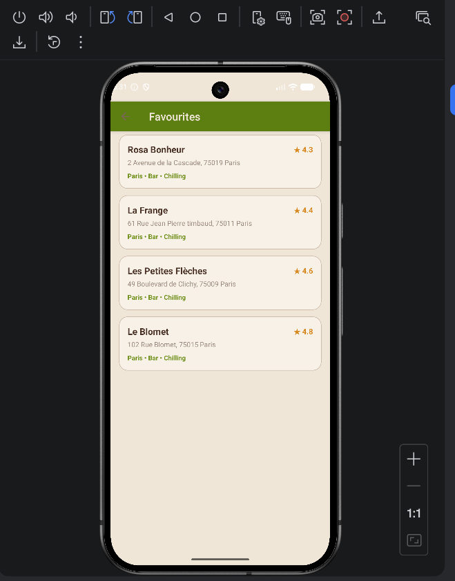
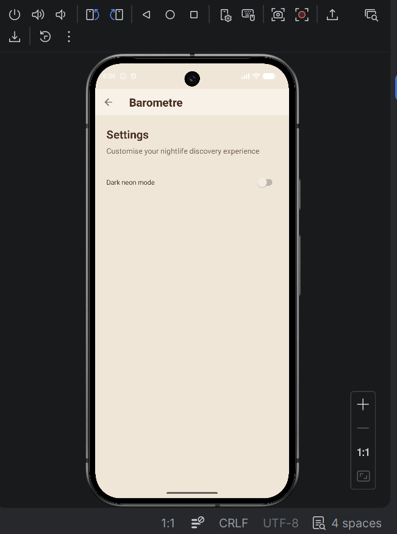

# Bar-ometre

Bar-ometre is an Android nightlife discovery app for finding bars in Paris.
Users can browse bars on a map or in a searchable list, open detailed bar pages, and filter results by rating, type, or location.
The app combines Google Maps, GPS, SQLite storage, fragments, menus, and multiple activities into one demo-ready Android project.
It is designed around quick discovery: find a nearby place, inspect details, save favourites, and share a bar with friends.

## Features

- Map-based bar discovery with Google Maps markers.
- Bar list with `RecyclerView`, custom adapter, and custom card layout.
- Search bar for filtering bars by name.
- Sort bars by rating from the main toolbar menu.
- Filter screen for bar type, minimum rating, and distance options.
- Bar detail screen with photo loading through Glide.
- Bar details include name, rating, address, phone, opening hours, website, map navigation, and sharing.
- Implicit intents for sharing a bar, opening websites, dialing phone numbers, and launching Google Maps navigation.
- Favourites screen backed by repository/database logic.
- SQLite storage through `SQLiteOpenHelper`.
- Offline banner and connectivity handling with a `BroadcastReceiver`.
- GPS permission flow.
- Portrait layout with one main content pane.
- Landscape layout with list and map side by side.
- Light/dark theme support with shared color and style resources.

## Build Instructions

1. Open the repository in Android Studio.
2. Open the Android project folder:

   ```text
   app-project/
   ```

3. Add a Google Maps API key. The app reads it from the Gradle property `MAPS_API_KEY`.

   Create or edit `app-project/local.properties` and add:

   ```properties
   MAPS_API_KEY=your_google_maps_api_key_here
   ```

4. Sync Gradle in Android Studio.
5. Run the app on an emulator or Android device with Google Play Services.

Command-line build:

```bash
cd app-project
./gradlew :app:assembleDebug
```

The debug APK is generated under:

```text
app/build/outputs/apk/debug/
```

## Screenshots

| Screen | Screenshot |
| --- | --- |
| Bar list |  |
| Map view |  |
| Landscape split view |  |
| Bar detail |  |
| Favourites |  |
| Settings |  |

## Who Did What

### Karma - Bar Discovery and Map

- Owned `MainActivity` as the main app entry point.
- Integrated `MapFragment` and Google Maps SDK.
- Displayed bars as map markers.
- Wired marker taps into bar selection/detail navigation.
- Built the landscape list + map split layout.
- Added map/list navigation from the toolbar.

### Tristan - Bar List and Search

- Built `BarListFragment`.
- Implemented the `RecyclerView` bar list.
- Created and maintained `BarAdapter`.
- Created the custom bar card layout.
- Added search and result rendering.
- Handled list sorting from the toolbar flow.

### Peushi - Bar Detail and Sharing

- Built `BarDetailActivity`.
- Built `BarDetailFragment`.
- Displayed full bar information.
- Added Glide image loading.
- Added implicit intents for website, phone, Google Maps navigation, and sharing.
- Added detail menu/context actions.

### Jakub - Favourites and Offline Storage

- Built repository abstractions with `IBarRepository`.
- Implemented `BarRepository` with SQLite storage.
- Implemented `BarDbHelper` and seeded local bar data.
- Owned favourite CRUD operations.
- Added cached/offline bar access.
- Added connectivity handling through `ConnectivityReceiver`.

### Aleksandra - Filters, GPS, Settings, and Theme

- Built `FilterFragment`, `FilterOptions`, and `FilterViewModel`.
- Implemented GPS helper logic and runtime permission flow.
- Added "Bars near me" behavior.
- Built `SettingsActivity`.
- Added dark/light theme preference logic.
- Owned `themes.xml`, `styles.xml`, and shared color resources.
